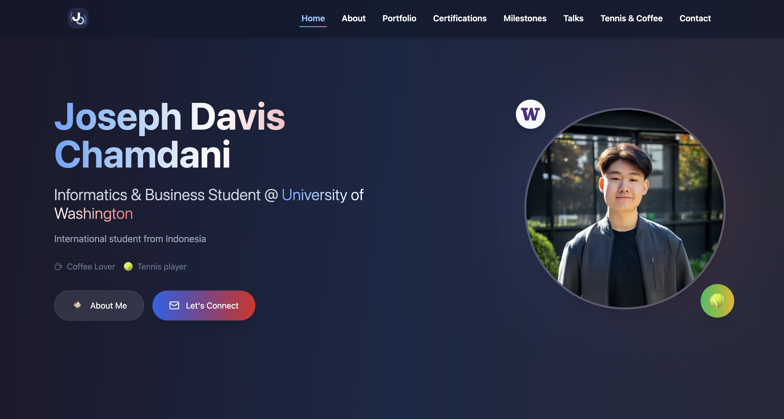

<a href="https://joechamdani.com" target="_blank">
  
</a>

# Joseph Davis Chamdani – Portfolio Website

[](https://joechamdani.com)


---

## 📌 About

This is my personal **portfolio website** where I showcase my background, projects, certifications, experiences, and interests.  

The site also highlights my journey as an **Informatics & Business student @ University of Washington** and includes personal touches like my love for tennis 🎾 and coffee ☕.

👉 Live Site: **[joechamdani.com](https://joechamdani.com)**  

---

## 🚀 Tech Stack

- ⚛️ **React (TypeScript)** – Frontend framework  
- 🎨 **TailwindCSS** – Styling  
- 🎬 **Framer Motion** – Animations  
- 🖼️ **Lucide React Icons** – Icons  
- 🌐 **Vite** – Build tool  
- ☁️ **Hostinger** – Hosting  

---

## 📂 Project Structure

```
src/
 ├── components/       # Reusable React components (Hero, About, Portfolio, etc.)
 │    ├── Hero.tsx
 │    ├── About.tsx
 │    ├── Portfolio.tsx
 │    ├── Certifications.tsx
 │    ├── Milestones.tsx
 │    ├── Talks.tsx
 │    ├── TennisCoffeeSection.tsx
 │    ├── RacketCard.tsx
 │    ├── Footer.tsx
 │    └── Navbar.tsx
 │
 ├── data/             # JSON data for milestones, credentials, etc.
 │    ├── milestones.json
 │    └── credentials.json
 │
 ├── hooks/            # Custom React hooks
 ├── lib/              # Utilities
 ├── pages/            # Page-level components
 ├── App.tsx           # Main app entry
 └── main.tsx          # Vite bootstrap

public/
 ├── images/           # Portfolio images
 ├── logos/            # Logos
 └── media/            # Media files (screenshots, certs, etc.)
```

---

## ⚡ Features

- 📖 **Hero, About, Portfolio, Certifications, Milestones, Talks**  
- 🎾 **Lifestyle Section** (Tennis & Coffee)  
- 🎨 **Dark theme + glassmorphism design**  
- 📱 **Responsive layout for all devices**  
- 🔗 **Live links to projects, certificates, and experiences**  

---

## 🖼️ Screenshots

### Home Section


---

## 🛠️ Setup & Installation

Clone the repo and install dependencies:

```bash
https://github.com/JosephDavisC/Website-Portfolio.git
cd Website-Portfolio
npm install
```

Run locally:

```bash
npm run dev
```

Build for production:

```bash
npm run build
```

---

## ☕️ Deployment

This site is deployed on **Hostinger** with a custom domain: [joechamdani.com](https://joechamdani.com).  
You can also easily deploy it on either **Vercel** or **Netlify**.

---
