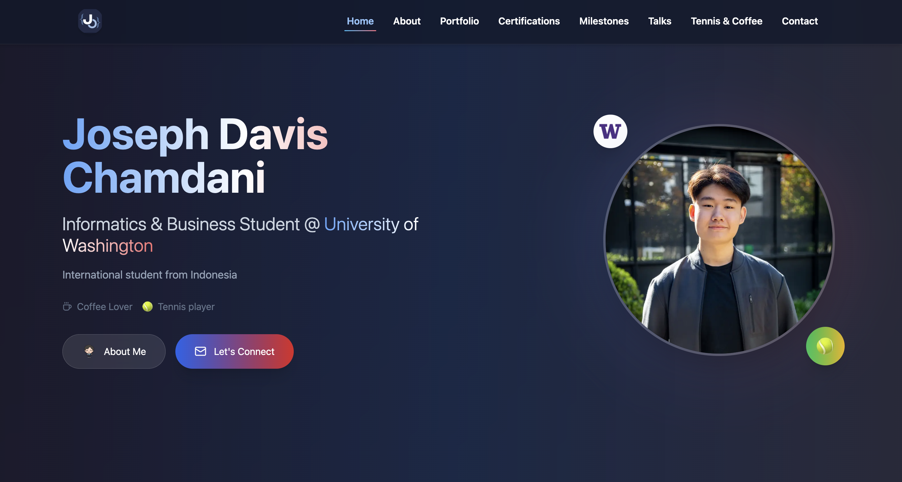

<a href="https://joechamdani.com" target="_blank">
  
</a>

# Joseph Davis Chamdani – Portfolio Website

[](https://joechamdani.com)


---

## 📌 About

This is my personal **portfolio website** where I showcase my background, projects, certifications, experiences, and interests.  

The site also highlights my journey as an **Informatics & Business student @ University of Washington** and includes personal touches like my love for tennis 🎾 and coffee ☕.

👉 Live Site: **[joechamdani.com](https://joechamdani.com)**  

---

## 🚀 Tech Stack

- ⚛️ **React (TypeScript)** – Frontend framework
- 🎨 **TailwindCSS** – Styling
- 🎬 **Framer Motion** – Animations
- 🖼️ **Lucide React Icons** – Icons
- 🌐 **Vite** – Build tool
- 🔀 **React Router** – Client-side routing for blog pages
- 🪖 **React Helmet** – SEO meta tags management
- ✉️ **EmailJS** – Contact form email integration
- ☁️ **Hostinger** – Hosting  

---

## 📂 Project Structure

```
src/
 ├── components/       # Reusable React components
 │    ├── sections/   # Main page sections
 │    │    ├── Hero.tsx
 │    │    ├── About.tsx
 │    │    ├── Portfolio.tsx
 │    │    ├── Blog.tsx
 │    │    ├── Certifications.tsx
 │    │    ├── Milestones.tsx
 │    │    ├── Talks.tsx
 │    │    ├── TennisCoffeeSection.tsx
 │    │    └── Contact.tsx
 │    └── shared/     # Shared components
 │         ├── Navbar.tsx
 │         ├── Footer.tsx
 │         ├── ContactForm.tsx
 │         └── RacketCard.tsx
 │
 ├── data/             # JSON data for content
 │    ├── milestones.json
 │    ├── credentials.json
 │    └── articles.json
 │
 ├── hooks/            # Custom React hooks
 ├── lib/              # Utilities
 ├── pages/            # Page-level components
 │    ├── Index.tsx   # Homepage
 │    └── ArticlePage.tsx  # Blog article pages
 ├── App.tsx           # Main app entry with routing
 └── main.tsx          # Vite bootstrap

public/
 ├── article_media/    # Blog article images
 │    └── bc-hacks-2024/
 ├── images/           # Portfolio images
 ├── logos/            # Logos
 └── media/            # Media files (screenshots, certs, etc.)

scripts/
 └── generate-blog-meta.js  # Generates static HTML for SEO
```

---

## ⚡ Features

- 📖 **Hero, About, Portfolio, Blog & Articles, Certifications, Milestones, Talks**
- 📝 **Blog Section** with full article pages and SEO meta tags for social media sharing
- 🎾 **Lifestyle Section** (Tennis & Coffee)
- ✉️ **Contact Form** with EmailJS integration and auto-reply confirmation
- 🎨 **Dark theme + glassmorphism design**
- 📱 **Responsive layout for all devices**
- 🔗 **Live links to projects, certificates, and experiences**
- 🔍 **SEO optimized** with Open Graph tags for LinkedIn, Facebook, Twitter, WhatsApp  

---

## 🖼️ Screenshots

### Home Section



---

## 🛠️ Setup & Installation

Clone the repo and install dependencies:

```bash
git clone https://github.com/JosephDavisC/Portfolio-Website.git
cd Portfolio-Website
npm install
```

### Environment Variables

For the contact form to work, create a `.env` file in the root directory:

```env
VITE_EMAILJS_SERVICE_ID=your_service_id
VITE_EMAILJS_TEMPLATE_ID=your_template_id
VITE_EMAILJS_AUTOREPLY_TEMPLATE_ID=your_autoreply_template_id
VITE_EMAILJS_PUBLIC_KEY=your_public_key
```

Run locally:

```bash
npm run dev
```

Build for production:

```bash
npm run build
```

---

## ☕️ Deployment

This site is deployed on **Hostinger** with a custom domain: [joechamdani.com](https://joechamdani.com).  
You can also easily deploy it on either **Vercel** or **Netlify**.

---

⚠️ Note: Some browser extensions (e.g. Better Campus, readability tools) may alter the site’s appearance.  
For the best experience, please view with extensions disabled or whitelist this site.

---