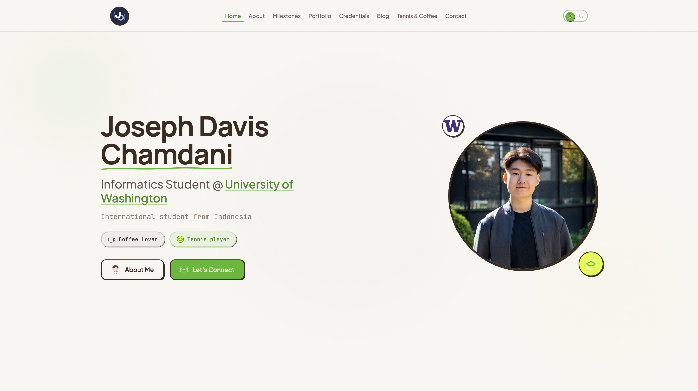
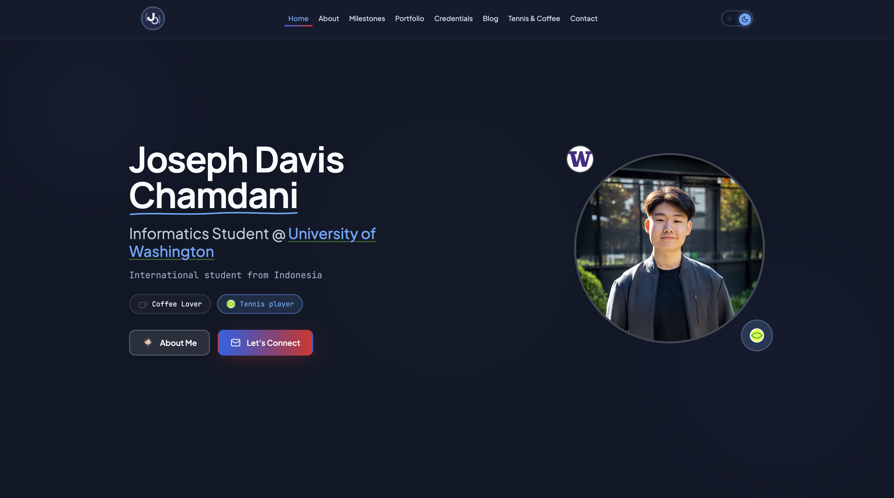

<a href="https://joechamdani.com" target="_blank">
  
</a>

# Joseph Davis Chamdani – Portfolio v2.0

[](https://joechamdani.com)
[](https://joechamdani.com)


---

## About

This is my personal **portfolio website** where I showcase my background, projects, certifications, experiences, and interests.

The site also highlights my journey as an **Informatics student @ University of Washington** and includes personal touches like my love for tennis and coffee.

Live Site: **[joechamdani.com](https://joechamdani.com)**

---

## Design Evolution

Version 2.0 marks a complete redesign—moving away from generic dark-mode templates toward a **Tactile, Paper-Textured aesthetic** that reflects who I am.

### Key Highlights

- **Organic Palette**: The color system draws inspiration from two of my passions—**Tennis** (Court Green `#4CBB17`) and **Coffee** (Espresso Brown `#3D2B1F`). This creates a warm, approachable feel in light mode.

- **Custom Interactions**: Physics-based tennis ball particle systems, animated coffee steam SVGs, and hand-crafted micro-interactions replace generic UI patterns. Every animation is purposefully designed—no generic libraries or emoji fallbacks.

- **Dual-Identity Theme System**: A custom-engineered theme toggle allows seamless switching between the new light mode (paper textures, neobrutalist shadows) and a refined dark mode (glassmorphism, neon blue accents). Both modes transition with a premium 500ms fade.

- **Neobrutalist Design Language**: Cards feature tactile offset shadows, hand-drawn scribble underlines, and playful hover states that make the interface feel tangible and crafted.

---

## Tech Stack

- **React (TypeScript)** – Frontend framework
- **TailwindCSS** – Styling
- **Framer Motion** – Animations
- **Lucide React Icons** – Icons
- **Vite** – Build tool
- **React Router** – Client-side routing for blog pages
- **React Helmet** – SEO meta tags management
- **EmailJS** – Contact form email integration
- **Hostinger** – Hosting

---

## Project Structure

```
src/
 ├── components/       # Reusable React components
 │    ├── sections/   # Main page sections
 │    │    ├── Hero.tsx
 │    │    ├── About.tsx
 │    │    ├── Portfolio.tsx
 │    │    ├── Blog.tsx
 │    │    ├── Certifications.tsx
 │    │    ├── Milestones.tsx
 │    │    ├── Talks.tsx
 │    │    ├── TennisCoffeeSection.tsx
 │    │    └── Contact.tsx
 │    └── shared/     # Shared components
 │         ├── Navbar.tsx
 │         ├── Footer.tsx
 │         ├── ContactForm.tsx
 │         └── RacketCard.tsx
 │
 ├── contexts/         # React contexts
 │    └── ThemeContext.tsx  # Theme state management
 │
 ├── data/             # JSON data for content
 │    ├── milestones.json
 │    ├── credentials.json
 │    ├── projects.json
 │    └── articles.json
 │
 ├── hooks/            # Custom React hooks
 ├── lib/              # Utilities
 ├── pages/            # Page-level components
 │    ├── Index.tsx   # Homepage
 │    ├── ProjectsPage.tsx  # All projects with filtering
 │    └── ArticlePage.tsx  # Blog article pages
 ├── App.tsx           # Main app entry with routing
 └── main.tsx          # Vite bootstrap

public/
 ├── article_media/    # Blog article images
 │    └── bc-hacks-2024/
 ├── images/           # Portfolio images
 │    ├── chibis/     # Custom chibi illustrations
 │    ├── moments/    # Tennis & coffee photos
 │    └── rackets/    # Tennis racket images
 ├── cursors/          # Custom cursor images
 ├── logos/            # Logos
 └── media/            # Media files (screenshots, certs, etc.)

scripts/
 └── generate-blog-meta.js  # Generates static HTML for SEO
```

---

## Features

- **Hero, About, Portfolio, Blog & Articles, Certifications, Milestones, Talks**
- **Blog Section** with full article pages and SEO meta tags for social media sharing
- **Projects Page** with category filtering (AI, Web, Games, Data)
- **Lifestyle Section** (Tennis & Coffee) with racket specs and photo carousel
- **Contact Form** with EmailJS integration and auto-reply confirmation
- **Dual-Identity Theme System**: Warm Light Mode + Sleek Dark Mode
- **Custom-engineered SVG animations and particle systems** (No generic emojis)
- **Responsive layout for all devices**
- **Live links to projects, certificates, and experiences**
- **SEO optimized** with Open Graph tags for LinkedIn, Facebook, Twitter, WhatsApp
- **Easter Eggs**: Hidden interactions throughout the site

---

## Screenshots

### Light Mode



### Dark Mode



---

## Setup & Installation

Clone the repo and install dependencies:

```bash
git clone https://github.com/JosephDavisC/Portfolio-Website.git
cd Portfolio-Website
npm install
```

### Environment Variables

For the contact form to work, create a `.env` file in the root directory:

```env
VITE_EMAILJS_SERVICE_ID=your_service_id
VITE_EMAILJS_TEMPLATE_ID=your_template_id
VITE_EMAILJS_AUTOREPLY_TEMPLATE_ID=your_autoreply_template_id
VITE_EMAILJS_PUBLIC_KEY=your_public_key
```

Run locally:

```bash
npm run dev
```

Build for production:

```bash
npm run build
```

---

## Deployment

This site is deployed on **Hostinger** with a custom domain: [joechamdani.com](https://joechamdani.com).

---

## Legacy Version (v1.0)

The original v1.0 design is preserved through the in-app theme toggle. The dark mode maintains the glassmorphism aesthetic and neon accents from v1.0, allowing visitors to experience both design philosophies.


You can view a walkthrough of the original v1.0 design here: [Watch v1.0 Walkthrough on YouTube](https://youtu.be/PpamoGkq0po)

---
